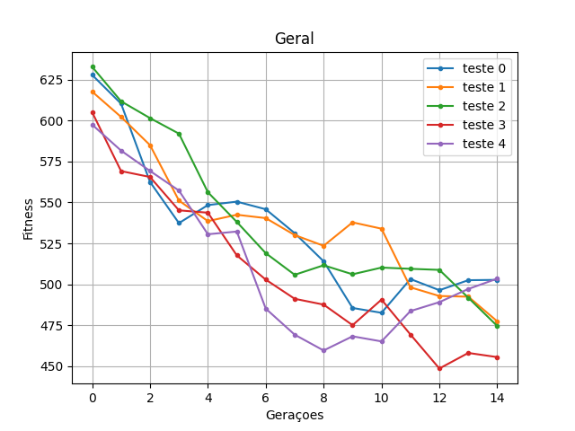
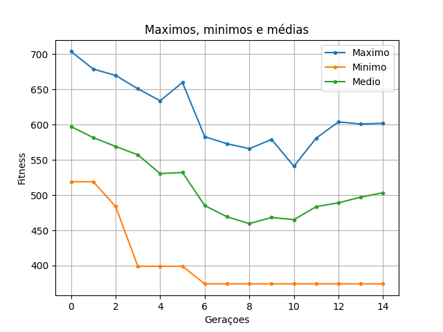
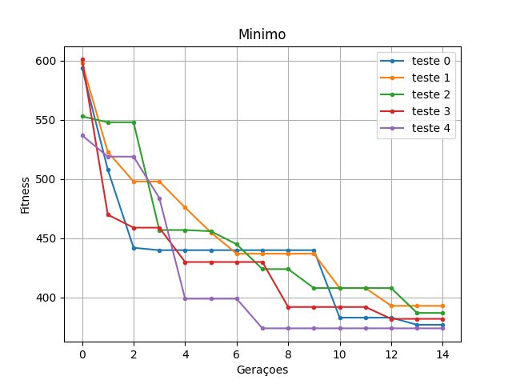

# Algoritmo Genético para Resolver o Problema do Caixeiro Viajante
## Bibliotecas
* Networkx - https://networkx.org/documentation/stable/# <Br>
* Matplotlib - https://matplotlib.org <Br>
## Como rodar
Para rodar digite no terminal, ou clique no "Run" se o programa tiver. 
````
    python main.py
````
Voce pode modificar a variavel arquivo para modificar a entrada do programa
## Exemplo de codigo
Parte Principal da funcao main() em main.py
```
     for teste in range(0, num_testes):
            fitness_teste = []
            media_geracao = []
            estatisticas_fitness = []
            print(f"Teste {teste}")
            for geracao in range(0, num_geracoes):
                print(f"Geracao {geracao}")
                if geracao == 0:
                    populacao.geracao_aleatoria()
                else:
                    populacao.geracao_cruzamento()
        ...
````
## Resultados
Graficos Formados com a biblioteca matplotlib:<br>






## Contato

Gabriel da Silva Souza - gabrielsisou@gmail.com

